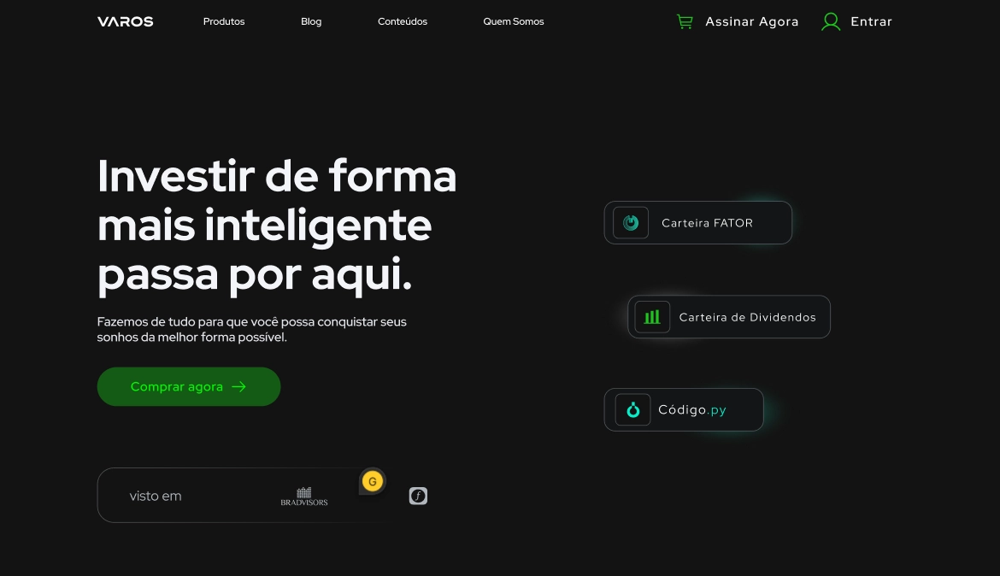

# 🎯 Landing Page para [VAROS](https://varos.com.br/)

Este projeto é um teste técnico de um processo seletivo para a vaga de Desenvolvedor Front-End Júnior, em janeiro de 2024.  
O objetivo do teste é desenvolver uma Landing Page a partir do design desenvolvido no Figma.  
[LINK DO FIGMA](https://www.figma.com/design/39IZ0eafZeh7tVr5StzBFS/Processo-Seletivo?node-id=1-249&t=84HKOoxVL4JGfzuB-1)

### REQUISITOS

✅ Next.Js - Framework React.  
✅TypeScript - SuperSet do JavaScript para tipagem estática.  
✅ Tailwind CSS - Estilização
